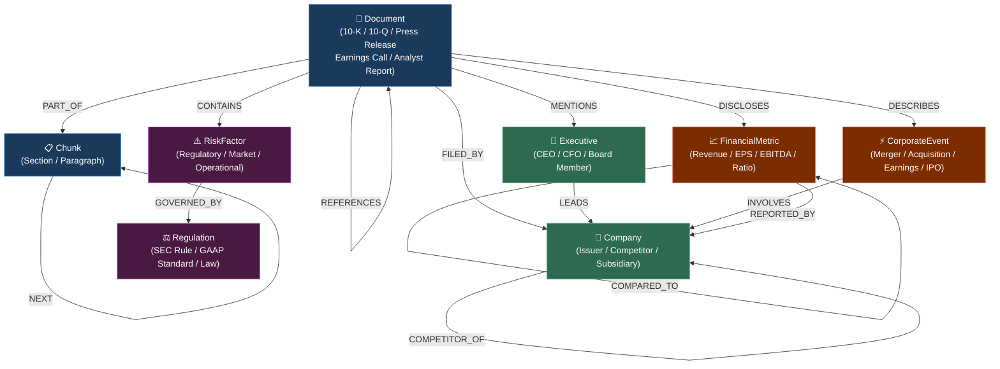
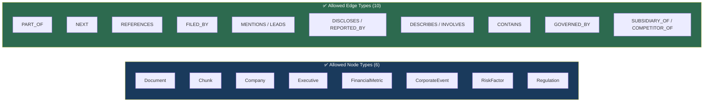
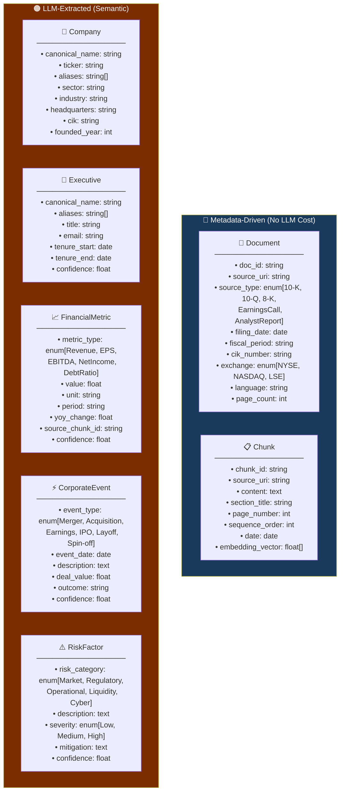
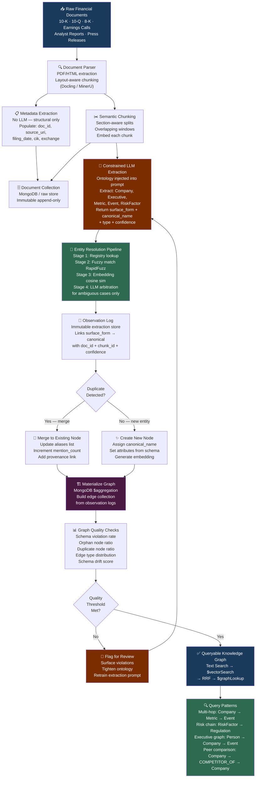
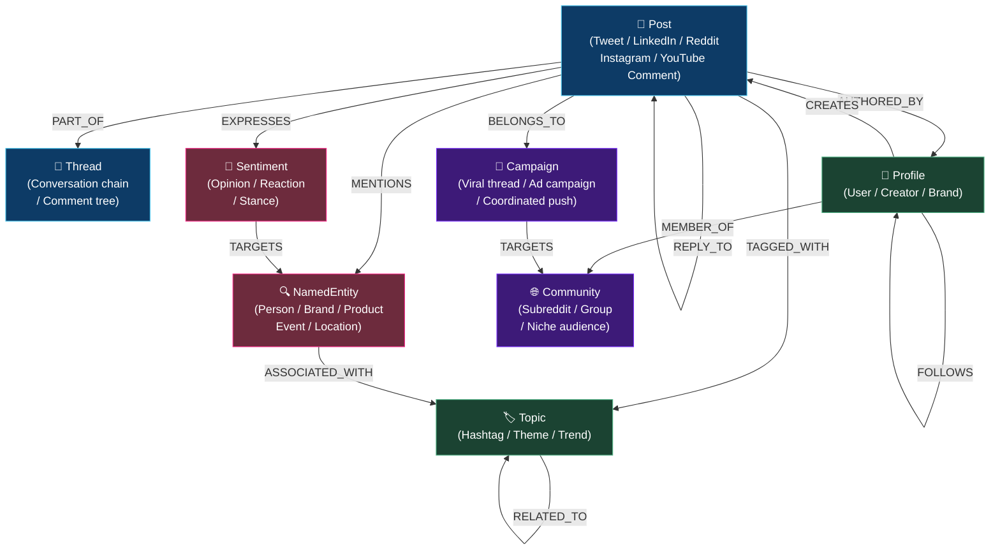
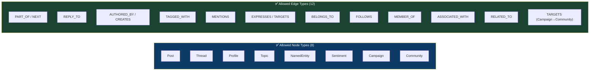
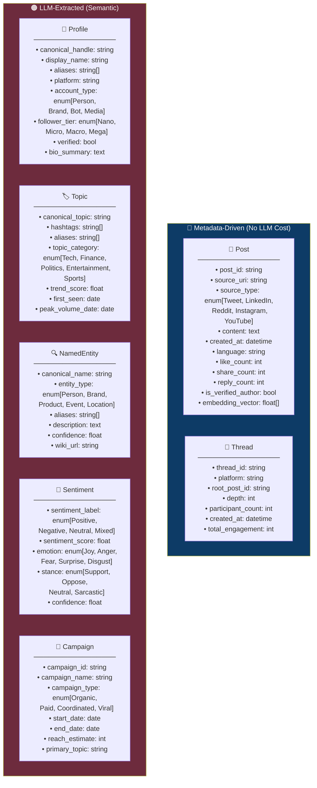
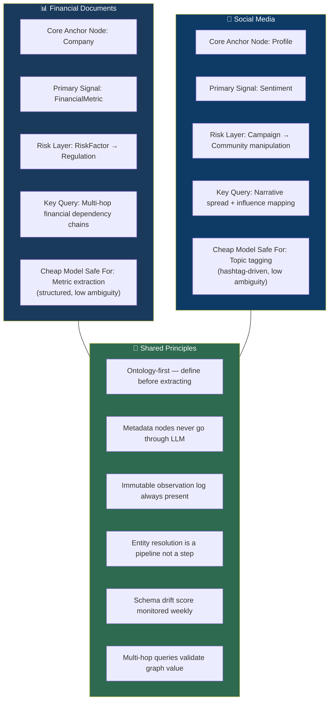

# GraphRAG Ontologies & Knowledge Graph Construction
### Two Use Cases: Financial Documents · Social Media

> **Reference Architecture:** Each use case is broken into three layers —
> **(1) Document Ontology** → **(2) Attribute Schemas** → **(3) Knowledge Graph Build Pipeline**

---

---

# 📊 USE CASE 1 — Financial Documents

> **Domain:** SEC filings, earnings reports, analyst notes, press releases, regulatory disclosures

---

## 1.1 — Document Ontology (Financial)

Defines the **node types** and **edge types** that govern what can exist in the graph.
The LLM can only extract what is defined here — nothing more.

### Node & Edge Type Registry

---

## 1.2 — Attribute Schemas (Financial)

Defines the **properties** attached to each node type.
Metadata nodes (Document, Chunk) are populated structurally — **no LLM needed**.
Semantic nodes (Company, Executive, Metric, Event, Risk) use **LLM extraction**.

---

## 1.3 — Knowledge Graph Build Pipeline (Financial)

End-to-end flow from raw documents to a queryable graph.

---

---

# 📱 USE CASE 2 — Social Media

> **Domain:** Tweets/X posts, LinkedIn posts, Reddit threads, Instagram captions, YouTube comments, blog posts

---

## 2.1 — Document Ontology (Social Media)

### Node & Edge Type Registry

---

## 2.2 — Attribute Schemas (Social Media)

---

## 2.3 — Knowledge Graph Build Pipeline (Social Media)

```mermaid
flowchart TD
    A["📥 Raw Social Media Data\nTweets · LinkedIn Posts · Reddit Threads\nInstagram Captions · YouTube Comments"]

    A --> B["🔌 Platform Ingestion Layer\nAPI connectors per platform\nRate-limit aware polling\nWebhook / streaming ingestion"]

    B --> C["🧹 Pre-processing\nDe-duplication by post_id\nURL normalization\nEmoji → text normalization\nLanguage detection"]

    C --> D["📋 Metadata Population\nNo LLM — structural only\npost_id, source_uri, platform\ncreated_at, engagement counts\nthread reconstruction"]

    C --> E["✂️ Content Chunking\nPosts are atomic units\nThreads chunked by reply depth\nEmbed each post independently"]

    D --> F["🗄️ Raw Post Collection\nAppend-only store\nPreserve original content\n+ all metadata"]
    E --> F

    E --> G["🤖 Constrained LLM Extraction\nOntology injected into prompt\nExtract: Profile, Topic, NamedEntity\nSentiment, Campaign signals\nConstrain to defined enum values only"]

    G --> H["😄 Sentiment Analysis Layer\nDedicated sentiment model\n(cheaper than frontier LLM)\nLabel: sentiment + emotion + stance\nHandle sarcasm detection separately"]

    H --> I["🔎 Entity Resolution\nHandle: @mentions → Profile\n#hashtags → Topic canonicalization\nBrand name variants → NamedEntity\nFuzzy + embedding resolution"]

    I --> J["📝 Observation Log\nImmutable extraction store\npost_id + entity + type\n+ confidence + timestamp"]

    J --> K{"Duplicate\nProfile or\nEntity?"}

    K -->|"Yes — merge"| L["🔗 Merge Node\nConsolidate aliases\nAggregate sentiment history\nUpdate mention_count"]

    K -->|"No — new"| M["✨ Create New Node\nSet canonical attributes\nGenerate embedding\nAssign to community if known"]

    L --> N["🏗️ Materialize Graph\nBuild edges from observations\nPOST→AUTHORED_BY→PROFILE\nPOST→TAGGED_WITH→TOPIC\nPOST→EXPRESSES→SENTIMENT\nPOST→MENTIONS→ENTITY"]
    M --> N

    N --> O["📊 Graph Quality Checks\nBot account detection\nTopic drift monitoring\nSentiment distribution audit\nCross-platform entity alignment\nSchema violation rate"]

    O --> P{"Quality\nThreshold\nMet?"}

    P -->|"No"| Q["🔧 Flag & Remediate\nReview bot-like profiles\nMerge fragmented topics\nRetighten ontology constraints"]
    Q --> G

    P -->|"Yes"| R["✅ Queryable Social Graph"]

    R --> S["🔍 Query Patterns\nInfluencer mapping: Profile → FOLLOWS → Profile\nNarrative tracking: Topic → RELATED_TO → Topic\nSentiment chain: Entity → TARGETS → Sentiment over time\nCampaign attribution: Campaign → BELONGS_TO → Post → AUTHORED_BY → Profile\nCommunity detection: Profile → MEMBER_OF → Community → TARGETS"]

    style A fill:#0d3b66,color:#fff
    style G fill:#6d2b3d,color:#fff
    style H fill:#6d2b3d,color:#fff
    style I fill:#1b4332,color:#fff
    style N fill:#3d1a78,color:#fff
    style R fill:#0d3b66,color:#fff
    style S fill:#1b4332,color:#fff
    style Q fill:#6d2b3d,color:#fff
```

---

---

# 🔁 Cross-Use-Case Comparison

---